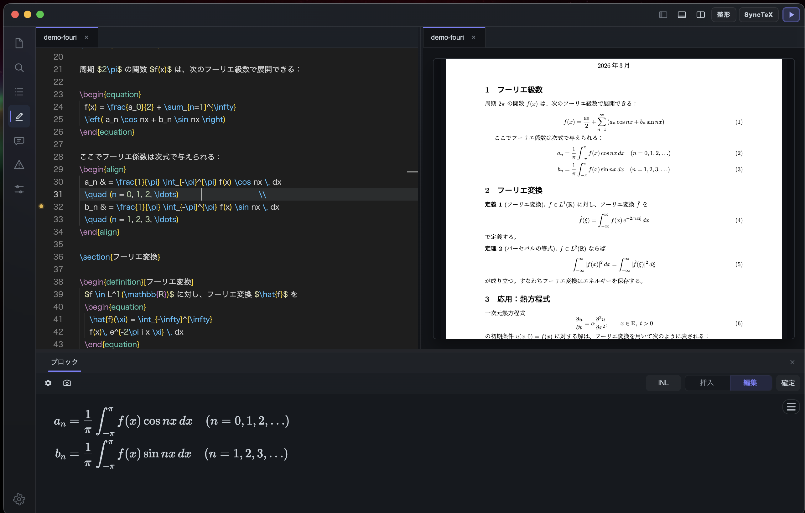

# TeX64

### A LaTeX editor for macOS — built for math-heavy writing.

[Website](https://tex64.com) · [Download](https://tex64.com/download) · [Docs](https://tex64.com/docs) · [Roadmap](./ROADMAP.md) · [FAQ](./FAQ.md)

---

TeX64 is a native macOS LaTeX editor designed for technical and academic writing. It runs entirely on your Mac — no cloud, no account, no internet required. Compile with your local MacTeX / TeX Live installation and get a live PDF preview as you write.

日本語: TeX64 は、数式中心の文書作成に向けた macOS 向け LaTeX エディタです。ライブ PDF プレビュー、数式編集、式の取り込み、変更確認に対応しています。

## Why TeX64?

**AI error fixing (Axiom)** — When compilation fails, Axiom reads the actual log output and tells you exactly what went wrong: _"Line 847: missing `\end{align}`"_ — with a one-click diff to fix it.

**Equation OCR** — Snap a photo of equations on a whiteboard or in a textbook. Drag it into TeX64. Get editable LaTeX code in seconds. Works with handwriting and printed math.

**Live PDF preview** — Click anywhere in the PDF to jump to the source. Click in the source to jump to the PDF. SyncTeX works out of the box.

**Structured math editing** — Build equations visually with a clickable palette, then hand-edit the LaTeX it produces. No lock-in — it's standard LaTeX the whole way through.

**Formula import** — Extract equations from existing documents directly into your workspace. Crop, select, and pull in formulas without retyping.

**Reviewable changes** — See diffs before applying modifications. Review what changed and why before committing to edits.

## Screenshots

| Editor + Live Preview | Structured Math Editing |
|:---:|:---:|
|  |  |

| Formula Import | Change Review |
|:---:|:---:|
|  |  |

## Getting Started

1. Install [MacTeX](https://www.tug.org/mactex/) or [TeX Live](https://www.tug.org/texlive/) if you haven't already
2. Download TeX64 from [tex64.com/download](https://tex64.com/download)
3. Open your project folder and hit compile — that's it

No account. No sign-up. No internet needed.

## About This Repository

This repository is the public showcase for TeX64. It contains product information, screenshots, a public roadmap, and a place to collect feedback. The core application code and internal implementation remain private.

## Feedback & Issues

Found a rough edge? Have a feature request? [Open an issue](https://github.com/heavyinthegame/tex64/issues/new/choose) — we read every one.

## Links

- [tex64.com](https://tex64.com)
- [Documentation](https://tex64.com/docs)
- [Support](https://tex64.com/support)
- [tex64ai@gmail.com](mailto:tex64ai@gmail.com)

---

Built for researchers, students, and anyone who writes math.

