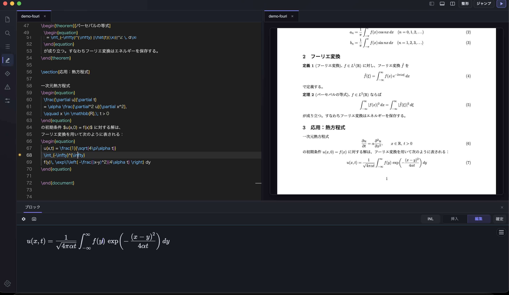
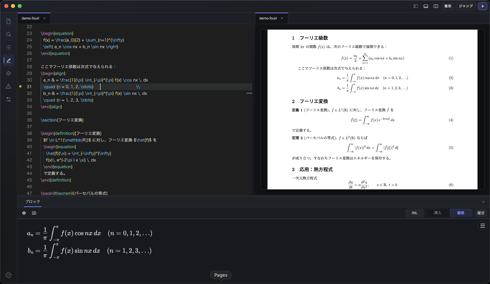
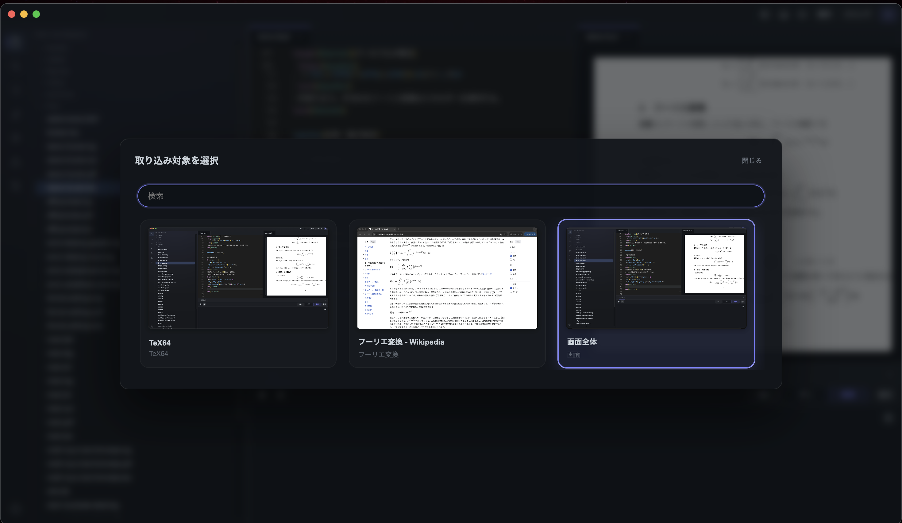
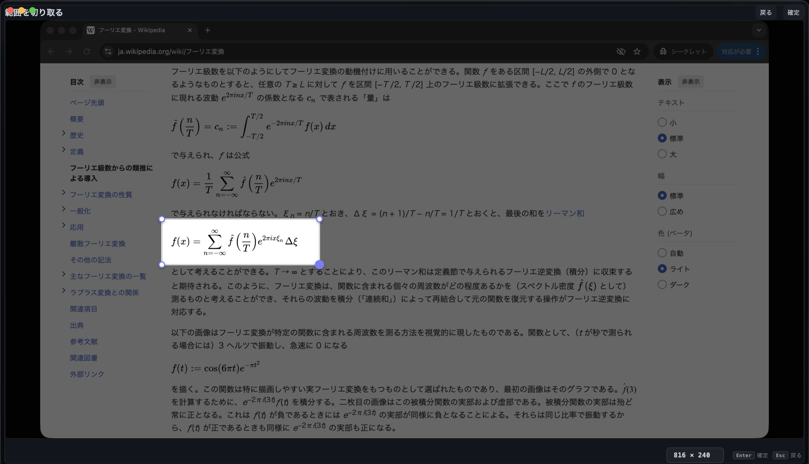
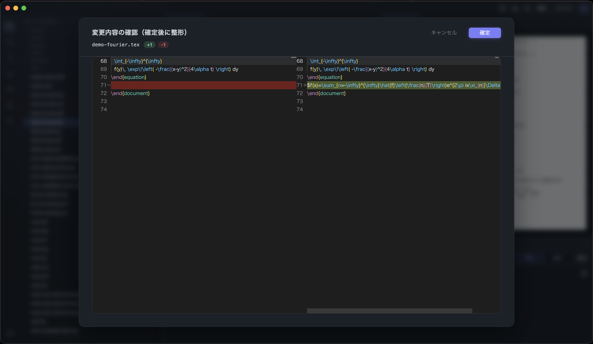
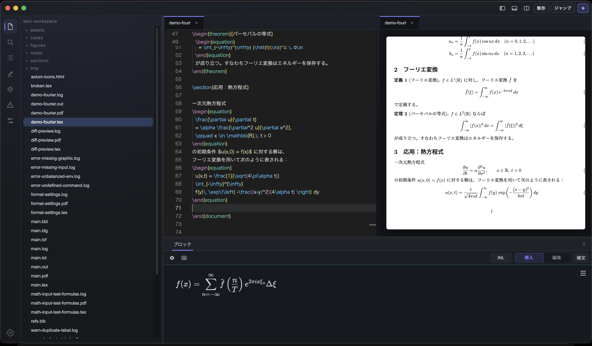

# TeX64: LaTeX Editor for macOS

TeX64 is a LaTeX editor for macOS with live PDF preview, structured math editing, equation editing, formula import, and reviewable changes for technical and academic writing.

Built for math-heavy LaTeX and TeX workflows, TeX64 helps you edit TeX source, write equations, and move between source and PDF faster.

日本語: TeX64 は、数式中心の文書作成に向けた macOS 向け LaTeX エディタです。ライブ PDF プレビュー、数式編集、式の取り込み、変更確認に対応しています。

[Download](https://tex64.com/download) · [Docs](https://tex64.com/docs) · [FAQ](FAQ.md) · [Roadmap](ROADMAP.md) · [Support](https://tex64.com/support)

This repository is the public showcase for the product. It contains product information, screenshots, a public roadmap, and a place to collect feedback. The core application code and internal implementation remain private.

## LaTeX Workflow Features

- Editing LaTeX with a live PDF preview
- Building math blocks without losing source control
- Pulling formulas from existing material into the workspace
- Reviewing changes before applying them

## Screenshots

### Editor + preview

### Structured math block editing

### Importing from existing material

### Reviewing generated changes

### Project workspace

## What is in this repo

- Product overview
- Public roadmap
- FAQ
- Screenshots and assets
- GitHub issues for feedback

## What is not in this repo

- Application source code
- OCR internals
- AI implementation details
- Prompt design
- Internal architecture and roadmap

## Links

- Website: [tex64.com](https://tex64.com)
- Download: [tex64.com/download](https://tex64.com/download)
- Docs: [tex64.com/docs](https://tex64.com/docs)
- Support: [tex64.com/support](https://tex64.com/support)
- Contact: [tex64ai@gmail.com](mailto:tex64ai@gmail.com)

## Current status

TeX64 is currently available as a macOS beta.

## Feedback

If you want to report a rough edge, ask a product question, or request a feature, open an issue in this repository.
